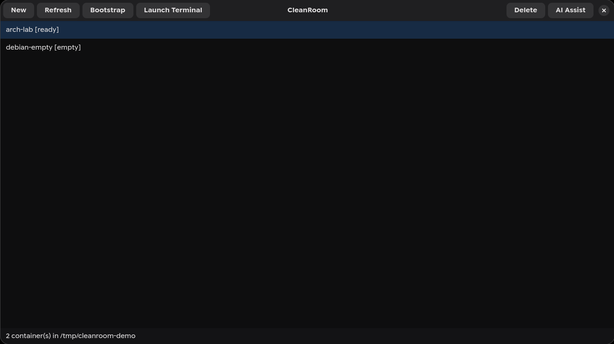
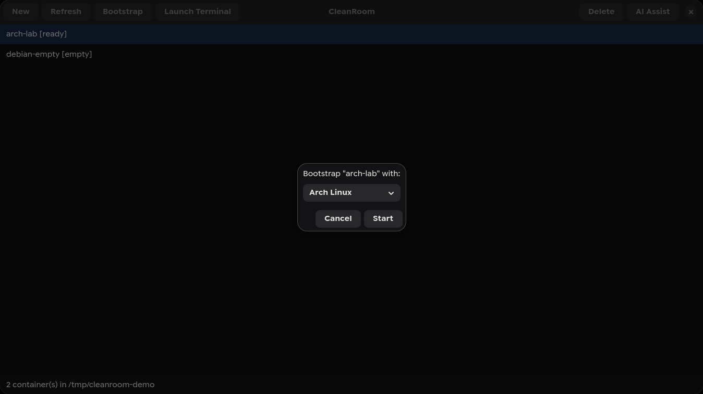
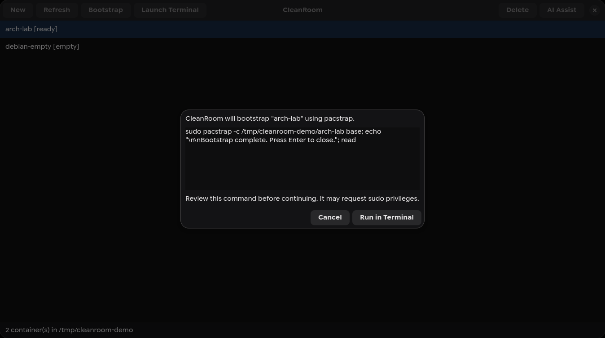
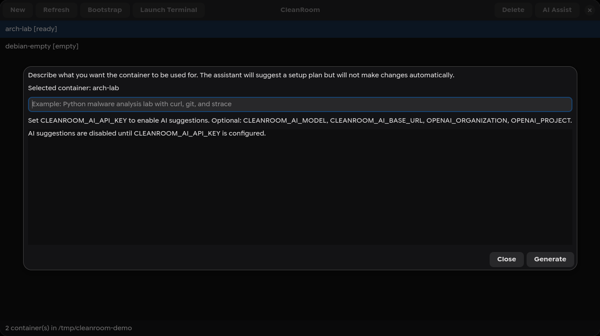

# CleanRoom

[](https://github.com/Torch4084/cleanroom/actions/workflows/ci.yml)

CleanRoom is a GTK4 desktop application for managing `systemd-nspawn` containers without dropping down to raw shell commands for every task.

It is aimed at developers, tinkerers, and security-minded Linux users who want lightweight isolated environments for testing packages, reproducing issues, or experimenting without polluting the host system.

## Screenshots

The screenshots below use a demo machines directory and do not run privileged commands.









## What it does

- Create new container directories under `/var/lib/machines`
- Bootstrap Arch or Debian-based roots with `pacstrap` or `debootstrap`
- Launch an interactive shell inside a selected container
- Delete containers with confirmation
- Show whether a container looks ready or still empty
- Preview privileged bootstrap and launch commands before they run
- Optionally generate AI-assisted setup plans for a container goal

## Requirements

### Runtime dependencies

- `python`
- `python-gobject`
- `gtk4`
- `libadwaita`
- `systemd-container`

### Optional bootstrap tools

- `arch-install-scripts` for `pacstrap`
- `debootstrap` for Debian-based roots

### Supported terminal launchers

CleanRoom currently looks for one of:

- `kitty`
- `alacritty`
- `gnome-terminal`

Distribution-specific setup notes are available in [docs/distro-workflows.md](docs/distro-workflows.md).
The project threat model is documented in [docs/threat-model.md](docs/threat-model.md).

## Installation

### Run from source

```bash
python3 cleanroom.py
```

### System install

```bash
chmod +x install.sh
./install.sh
```

### Arch packaging

The repository includes a `PKGBUILD` for packaging on Arch-based systems.

## Workflow

1. Create a new container entry.
2. Bootstrap it with a base distribution.
3. Launch a terminal inside the container.
4. Delete the container when you are done with it.

## Notes

- CleanRoom shells out to `sudo` for privileged operations.
- Containers live in `/var/lib/machines` by default.
- This project is intentionally small and focused on the most common `systemd-nspawn` workflows.

## Safety model

CleanRoom is designed to keep privileged actions explicit and reviewable:

- container names are validated before filesystem paths are built
- command-building helpers are covered by unit tests
- bootstrap and launch commands are previewed before opening a terminal workflow
- destructive deletion requires confirmation
- the optional AI assistant is advisory only and cannot execute privileged actions

See [SECURITY.md](SECURITY.md) for supported security reporting and threat-model details.

## Optional AI Assistant

CleanRoom includes an optional AI assistant that can suggest a container setup plan from a high-level goal.

It is advisory only:

- it does not create, bootstrap, or delete containers automatically
- it returns suggested distro, packages, commands, validation steps, and security notes
- all actions still require explicit user approval in the normal UI

Configure it with environment variables before launching the app:

```bash
export CLEANROOM_AI_API_KEY=your_api_key
export CLEANROOM_AI_MODEL=gpt-5-mini
python3 cleanroom.py
```

Optional variables:

- `CLEANROOM_AI_BASE_URL`
- `OPENAI_ORGANIZATION`
- `OPENAI_PROJECT`

## Contributing

Bug reports, packaging fixes, and UI improvements are welcome. See [CONTRIBUTING.md](CONTRIBUTING.md) for contribution guidelines.
Maintainer responsibilities are documented in [MAINTAINERS.md](MAINTAINERS.md).

Useful local checks:

```bash
pytest
python3 -m py_compile cleanroom.py cleanroom_core.py
ruff check .
```

See [docs/testing.md](docs/testing.md) and [docs/release-checklist.md](docs/release-checklist.md) for the full maintainer workflow.

## License

CleanRoom is released under the [MIT License](LICENSE).
